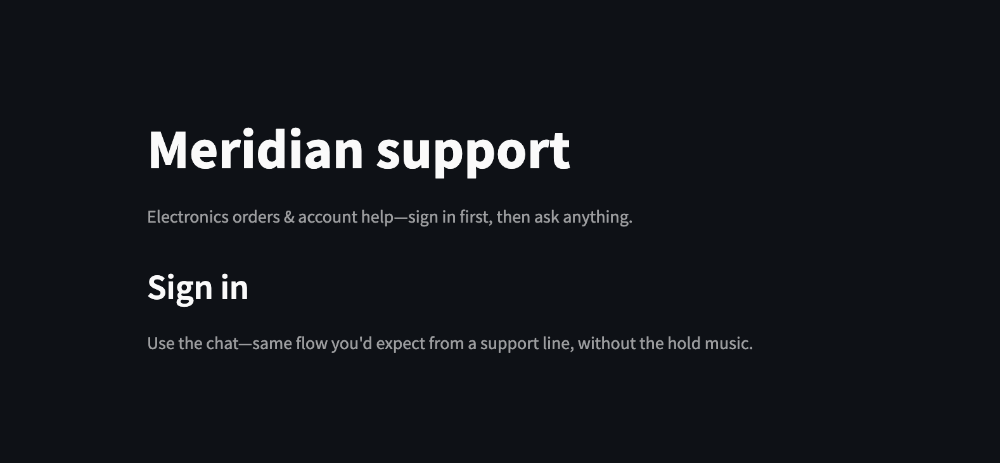
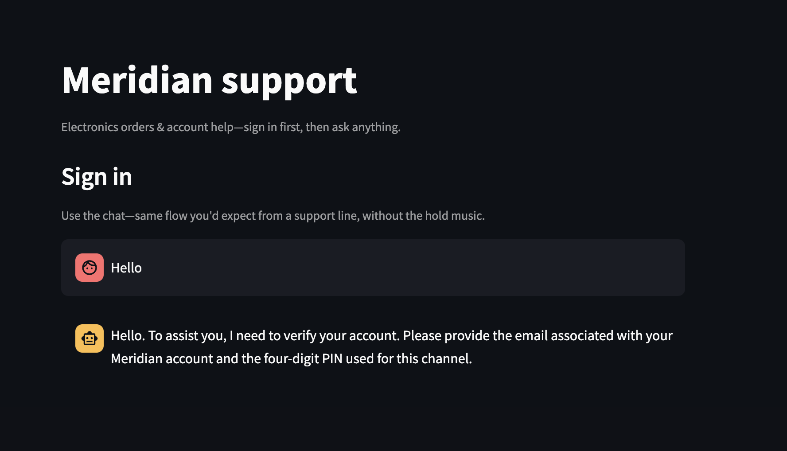
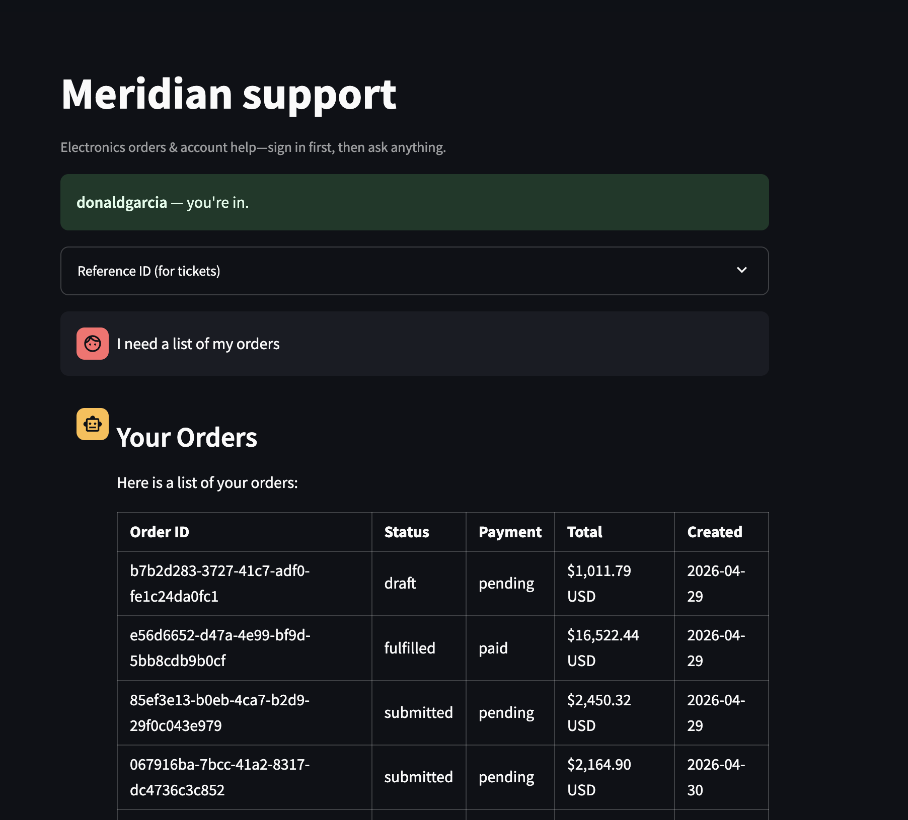
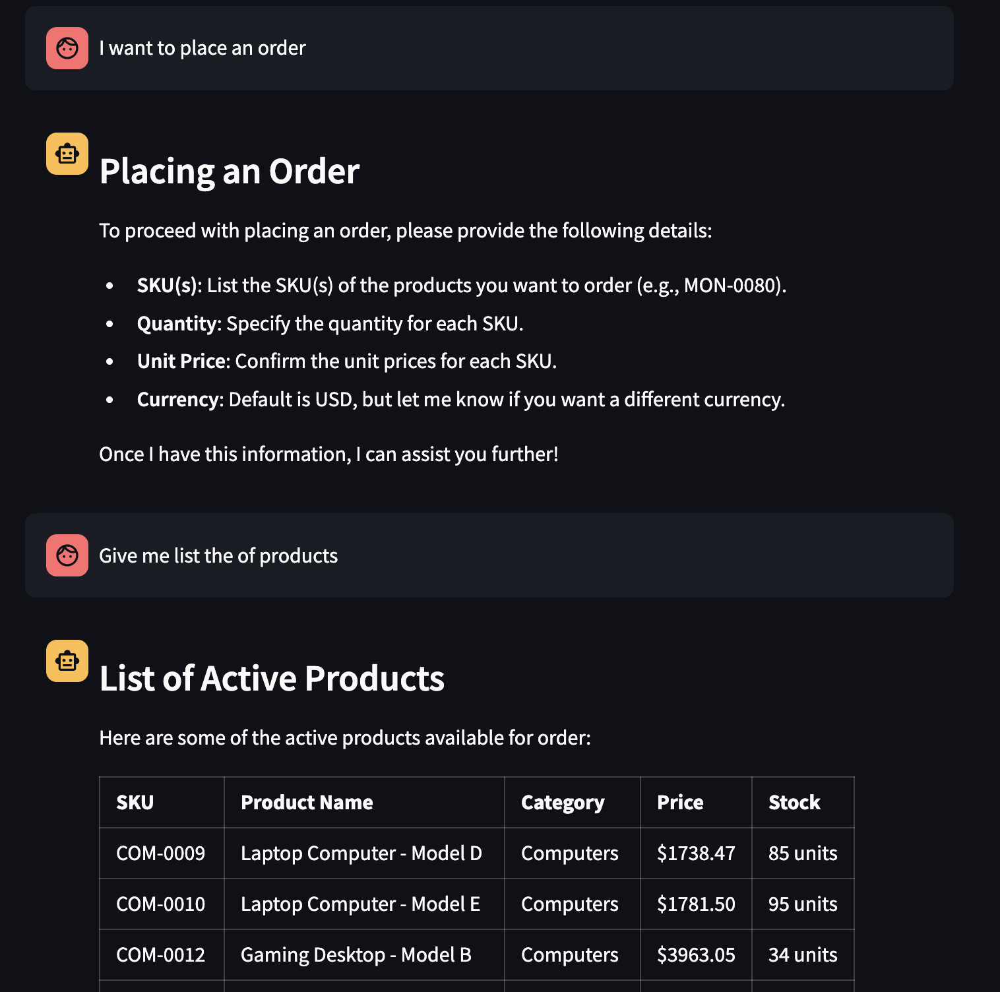
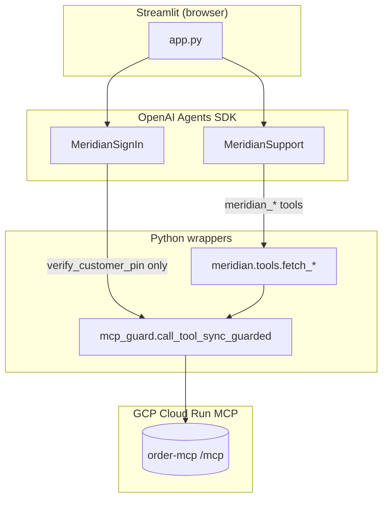

# Meridian Support

**Meridian Support** is a Streamlit application for **Meridian Electronics** customer service: conversational **email + 4‑digit PIN** sign-in, then an **OpenAI Agents**–driven assistant that calls a **guarded MCP** order/catalog backend. Responses can **stream** token-by-token (support chat), outputs are **structured** with Pydantic, and every MCP hop is **logged** with a per-turn **`trace_id`**.

This README is intentionally long: it records **what was implemented**, **why key decisions were made**, and **how to validate** behavior manually and with automated tests.

---

## Table of contents

1. [Screenshots & user journey](#screenshots--user-journey)  
2. [What was built (feature inventory)](#what-was-built-feature-inventory)  
3. [Architecture](#architecture)  
4. [Design decisions (amplified)](#design-decisions-amplified)  
5. [Configuration reference](#configuration-reference)  
6. [How to run locally](#how-to-run-locally)  
7. [How to test](#how-to-test)  
8. [Deployment](#deployment)  
9. [Repository layout](#repository-layout)  
10. [License](#license)

---

## Screenshots & user journey

### 1. Pre-authentication: product framing

Before a customer UUID exists in the session, the app explains the value proposition and routes all interaction through the **sign-in chat** (no catalog or order tools yet).



**What to notice:** Single-column Streamlit layout, dark theme, copy that sets expectations (“sign in first”)—this aligns with the **MCP guard** (see [Design decisions](#design-decisions-amplified)): nothing sensitive runs until `verify_customer_pin` succeeds.

---

### 2. Auth agent: conversational verification

The **MeridianSignIn** agent collects **email** and **Meridian’s four-digit channel PIN** (not the email password). Instructions deliberately avoid leaking whether an email exists in the backend.



**What to notice:** There is no HTML login form—the **agent** is the UX. That choice trades a traditional form for a single conversational surface, but it requires a **structured final object** (`AuthAgentResponse`) and careful prompt copy so the model does not invent credentials or over-share on failures.

---

### 3. Signed-in support: live order data

After verification, the same app shell promotes the user to **signed-in** state. The **MeridianSupport** agent can call `list_orders` (and other tools); the UI shows **markdown tables** built from real MCP text.



**What to notice:** Order IDs are UUIDs, statuses and payment states vary—evidence of **live MCP** reads, not a static mock. Session-scoped identity is enforced in wrappers (e.g. `list_orders` always resolves the customer id to the signed-in principal).

---

### 4. Guardrails for writes + catalog breadth

For **placing orders**, the agent is instructed to confirm **SKU, quantity, unit price, and currency** before calling `create_order` (and that tool is only registered when `MERIDIAN_ENABLE_ORDER_SUBMIT` is enabled). For **read-only** catalog questions, `list_products` can return large tabular summaries.



**What to notice:** The assistant separates **high-impact** actions (order creation, inventory mutation) from **read** paths. That mirrors the **opt-in env flag** for `create_order` at the integration layer—defense in depth so demos do not accidentally write to production-like data.

---

## What was built (feature inventory)

| Area | Implementation | Typical files |
|------|----------------|---------------|
| **UI shell** | Streamlit: auth chat vs support chat, sidebar account, logout confirmation flow | `app.py` |
| **MCP gate** | Every tool except `verify_customer_pin` requires non-empty `acting_customer_id` | `meridian/mcp_guard.py` |
| **MCP client** | Streamable HTTP session per synchronous tool call | `meridian/mcp_client.py` |
| **Auth** | OpenAI Agent + `submit_meridian_credentials` → `verify_customer_pin` | `meridian/auth_agent.py`, `meridian/auth.py` |
| **Support** | OpenAI Agent + seven function tools mapping to `fetch_*` wrappers | `meridian/support_agent.py`, `meridian/tools/*.py` |
| **Self-only access** | `resolve_target_customer_id`, `get_order` customer id parse vs session | `meridian/tools/get_customer.py`, `get_order.py`, … |
| **Order payloads** | Pydantic `OrderLineItem` + `TypeAdapter` list bounds | `meridian/models.py`, `meridian/tools/create_order.py` |
| **Structured outputs** | `output_type=AuthAgentResponse` / `SupportAgentResponse` | `meridian/auth_agent.py`, `support_agent.py`, `models.py` |
| **Streaming** | `Runner.run_streamed` on a worker thread → `st.write_stream` (support); chunked replay for auth/static text | `meridian/agent_streaming.py`, `app.py` |
| **Observability** | `trace_scope`, JSON/text formatters, `log_tool_event` | `meridian/observability.py`, tool modules |
| **Logout** | Phrase detection + yes/no parsing (no LLM required) | `meridian/logout_intent.py` |
| **CI / tests** | `pytest` across tools, auth, streaming, agents | `tests/` |
| **Deploy** | Docker + Cloud Run + GitHub Actions (WIF) | `Dockerfile`, `.github/workflows/deploy-gcp.yml`, `DEPLOY_GCP.md` |

---

## Architecture

High-level data flow:



1. **Unauthenticated:** only the auth agent runs; the only MCP path is **`verify_customer_pin`** (allowed without session in the guard).  
2. **Authenticated:** `acting_customer_id` is stored in Streamlit session state; support tools pass it into **`call_tool_sync_guarded`**, which blocks if it is missing.  
3. **Each `fetch_*`:** validates inputs, builds MCP arguments, logs start/success/error with **`trace_id`**, caps response size for UI safety.

---

## Design decisions (amplified)

### 1. Central MCP guard (`mcp_guard.py`)

**Decision:** A single choke point (`call_tool_sync_guarded`) enforces “no session → no tools,” with one explicit exception list.

**Why:** Scattered `if not customer_id` checks in every tool would drift. New tools could forget the check. A **single module** makes the security invariant obvious in code review and keeps the “MCP is powerful; Streamlit session is the trust root” story honest.

**Trade-off:** All tools must go through this path (no “friend” MCP shortcuts). That is intentional.

---

### 2. Tool wrappers instead of raw MCP from agents

**Decision:** Agents never call MCP directly. They call **`@function_tool`** functions that delegate to **`fetch_*`** modules.

**Why:**  
- **Validation** (SKU regex, order UUID format, order status enum, query length) happens before network I/O.  
- **Tenancy** (`resolve_target_customer_id`, order payload customer id match) is consistent.  
- **Logging** fields (suffix of customer id, not full PII) are uniform.  
- **Errors** can be classified (`GetOrderAccessError` vs generic MCP errors) and surfaced to the model as `[tool] message` strings so the run can complete with a helpful assistant message.

**Trade-off:** More boilerplate per MCP tool. The README treats that as **security and operability** overhead worth paying.

---

### 3. Structured outputs (`AuthAgentResponse`, `SupportAgentResponse`)

**Decision:** Both agents set `output_type` to a Pydantic model with a primary **`reply_markdown`** field (plus `tools_were_used` on support).

**Why:**  
- Forces the model to produce **parseable** final payloads for logging and future UI (e.g. splitting “summary” vs “appendix”).  
- `tools_were_used` supports **analytics** (“did this answer cite tools?”) without scraping natural language.

**Trade-off:** Streaming may include **partial JSON** in raw deltas; the UI still ends on **`reply_markdown`** from `final_output_as`. Support streaming runs in a **worker thread**; auth does **not** use the same path (see next item).

---

### 4. Auth streaming = chunked replay, support streaming = true tokens

**Decision:** `stream_support_agent_turn` uses **`Runner.run_streamed`** on a **dedicated thread + `asyncio.run`**. Auth uses **`run_auth_agent_turn`** (sync) then **`iter_static_text_chunks`** for `st.write_stream`.

**Why:** Support agent context is **immutable** (`SupportAgentContext`). Auth tools mutate **`MeridianAuthContext.pending_principal`** when verification succeeds. Running the auth agent on a **background thread** would race Streamlit’s main thread when reading session state after the turn.

**Trade-off:** Auth “streaming” is **cosmetic** (progressive reveal of the final string), not token-for-token from the model. That is documented so no one mistakes it for latency optimization.

---

### 5. `create_order` behind an environment flag

**Decision:** `meridian_create_order` is only attached to the support agent when `MERIDIAN_ENABLE_ORDER_SUBMIT` is truthy; Docker/CI use `requirements-prod.txt` without test-only deps.

**Why:** Inventory mutation is irreversible in a real backend. Demos and staging should default to **read-only** unless operators explicitly opt in.

---

### 6. Logout without an LLM

**Decision:** Regex / keyword parsing (`logout_intent.py`) for “sign out” and yes/no.

**Why:** Deterministic, fast, no API cost, no risk of the model misinterpreting a firm “yes.” Keeps a **safety-critical** path boring and testable.

---

### 7. Observability first-class

**Decision:** `trace_scope(new_trace_id())` around chat turns; `log_tool_event` with consistent event names (`support.agent.turn.start`, `create_order.success`, etc.).

**Why:** When something fails in MCP or OpenAI, you need to correlate **user action → trace_id → tool logs** without redeploying with print statements.

---

## Configuration reference

Copy **`.env.example`** to **`.env`** and set at minimum:

| Variable | Role |
|----------|------|
| `OPENAI_API_KEY` | Required for auth and support agents |
| `MCP_SERVER_URL` | Streamable HTTP MCP endpoint (default also set in `app.py`) |
| `OPENAI_MERIDIAN_AUTH_MODEL` | Optional; default `gpt-4o-mini` |
| `OPENAI_MERIDIAN_SUPPORT_MODEL` | Optional; default `gpt-4o-mini` |
| `MERIDIAN_ENABLE_ORDER_SUBMIT` | When `1`/`true`/`yes`, support agent exposes `create_order` |
| `MERIDIAN_LOG_LEVEL` | e.g. `INFO`, `DEBUG` |
| `MERIDIAN_LOG_FORMAT` | `text` or `json` (one JSON object per line) |

---

## How to run locally

```bash
python -m venv .venv
source .venv/bin/activate   # Windows: .venv\Scripts\activate
pip install -r requirements.txt
cp .env.example .env
# Edit .env: set OPENAI_API_KEY (and MCP_SERVER_URL if not using default)
streamlit run app.py
```

Open the URL Streamlit prints (usually `http://localhost:8501`).

---

## How to test

Testing is split into **automated** (`pytest`) and **manual** (browser + optional log inspection). Both matter: pytest proves guardrails and parsing; manual runs prove **OpenAI + MCP + Streamlit** integration.

### Automated tests (`pytest`)

```bash
# Full suite (recommended before push)
pytest tests/ -q

# Verbose with output for one file
pytest tests/test_get_order_tool.py -vv --tb=short

# Single test
pytest tests/test_auth.py::test_verify_customer_pin_maps_mcp_failure -q
```

**What the suite is designed to catch:**

| Test area | Example files | Intent |
|-----------|---------------|--------|
| MCP guardrails / parsing | `test_*_tool.py` | Invalid SKU, wrong customer id, order access, list_orders status enum |
| Auth | `test_auth.py` | PIN format, MCP failure mapping, principal round-trip, structured `build_auth_agent` |
| Support agent wiring | `test_support_agent.py` | `SupportAgentResponse`, tool list with/without `create_order`, optional smoke with real API key |
| Streaming helper | `test_agent_streaming.py` | Static chunk iterator used for auth/logout copy |
| Logout intent | `test_logout_intent.py` | Deterministic yes/no |

**Design note:** Many tool tests **monkeypatch** `call_tool_sync_guarded` so CI does not hit the real MCP. That isolates **your** validation and error mapping. For true integration, use manual testing below.

---

### Manual testing (checklist)

Use a **real** `OPENAI_API_KEY` and the default or your own `MCP_SERVER_URL`.

#### A. Sign-in flow (auth agent + MCP)

1. Open the app unsigned. Confirm UI matches **Screenshot 3** (title, sign-in section).  
2. Send a greeting. Confirm the assistant asks for **email + 4-digit PIN** (**Screenshot 4**).  
3. Enter valid credentials (per your MCP seed data). Confirm redirect to signed-in state and sidebar shows **display name / email**.  
4. **Negative:** Wrong PIN → neutral failure copy (no “email not found” vs “bad PIN” distinction).

**Amplifies:** Validates `mcp_guard` exception path is not used for `verify_customer_pin`, and `auth.py` parsing of customer block.

#### B. Support agent + tools (live MCP)

While signed in:

1. **Orders:** “List my orders” → tabular or text listing from MCP (**Screenshot 1**).  
2. **SKU:** “Tell me about MON-0080” (or another real SKU) → `get_product`.  
3. **Search:** “Laptops under $2000” → `search_products`.  
4. **Order detail:** Paste an order UUID that belongs to the session → `get_order`. Paste **another** customer’s order UUID → should refuse with access error (wrapper behavior).  
5. **Streaming:** Watch the assistant message **type in**; during tool use you may see short lines like `*meridian_list_orders…*` before the final markdown settles.

**Amplifies:** Validates `acting_customer_id` propagation, response caps, and streaming bridge.

#### C. Order creation (opt-in only)

1. With `MERIDIAN_ENABLE_ORDER_SUBMIT` **unset** or false: ask to place an order → assistant should say placement is not enabled / no tool.  
2. Set env to **true**, restart Streamlit: assistant should confirm line items, then call `create_order` with JSON `items_json`.  
3. **Screenshot 2** style: confirm it asks for structured line items before acting.

**Amplifies:** Confirms env-gated tool registration matches product expectation.

#### D. Logout

1. Say “log out” / “sign out” → confirm yes/no prompt.  
2. **Yes** → session cleared, back to sign-in.  
3. **No** → remain signed in.

**Amplifies:** Deterministic `logout_intent` path.

#### E. Observability (optional)

Set `MERIDIAN_LOG_FORMAT=json` and `MERIDIAN_LOG_LEVEL=INFO`. Trigger one support turn and confirm log lines include **`trace_id`** and tool event names for correlation.

---

### Why both pytest and manual tests?

| Concern | pytest | Manual |
|---------|--------|--------|
| Regex / validation | Strong | Redundant |
| OpenAI model behavior | Mocked or smoke only | Required |
| MCP availability / latency | Mocked | Required |
| Streamlit session + threading | Not covered | Required |

---

## Deployment

Production container: **`Dockerfile`** + **`requirements-prod.txt`**.

CI/CD: **`.github/workflows/deploy-gcp.yml`**. After you configure the GitHub **variables** in `DEPLOY_GCP.md`, **every push to `main`** runs `pytest`, then **builds and deploys** the image to **Cloud Run** automatically (deploy is gated on `refs/heads/main`). You can also run the workflow manually via **Actions → Run workflow**.

---

## Repository layout

| Path | Responsibility |
|------|----------------|
| `app.py` | Page config, session keys, auth vs support UI, `trace_scope` per turn |
| `meridian/mcp_guard.py` | Session gate for MCP |
| `meridian/mcp_client.py` | MCP session lifecycle |
| `meridian/auth.py` / `auth_agent.py` | PIN verification + sign-in agent |
| `meridian/support_agent.py` | Support agent + tools |
| `meridian/tools/` | One module per MCP surface (`fetch_*`) |
| `meridian/models.py` | `CustomerPrincipal`, contexts, `OrderLineItem`, agent response models |
| `meridian/agent_streaming.py` | Bridge streamed runs to Streamlit |
| `meridian/observability.py` | Logging + trace context |
| `images/` | Screenshots for this README (`1.png`–`4.png`) |
| `tests/` | Pytest coverage |
| `DEPLOY_GCP.md` | Operator runbook for GCP |

---

## License

Add a `LICENSE` file when you publish or distribute this repository.
